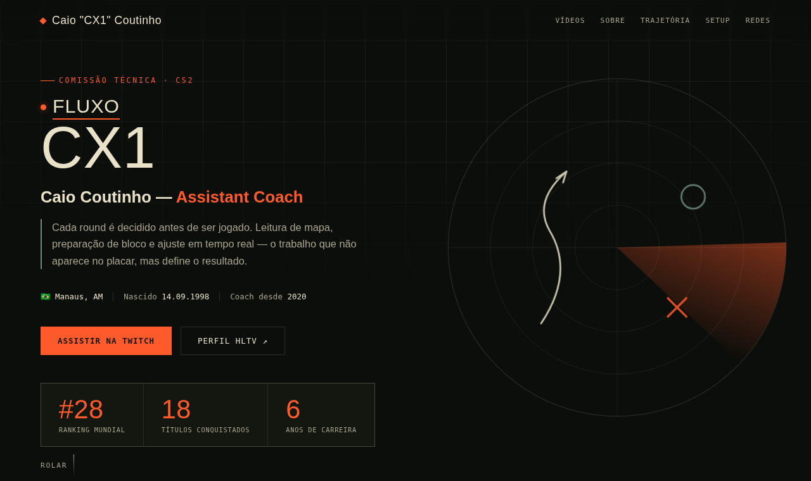

# CX1 · Caio Coutinho (CS2)

Página de perfil para **Caio "CX1" Coutinho**, assistant coach de Counter-Strike 2: trajetória, conquistas, setup e vídeos, com visual de prancheta tática.

🌐 **[Ver o site](https://japinha01.github.io/Caio_Cx1_Example/)**

## Destaques

- **Radar tático em SVG animado** no topo, com jogadas desenhadas
- **Linha do tempo da carreira** com troféus que expandem
- Números da carreira (ranking, títulos, anos), setup de treino, vídeos e redes
- Responsivo, sem framework e sem build: um único `index.html`

**Tecnologias:** HTML · CSS · JavaScript · SVG animado · GitHub Pages
